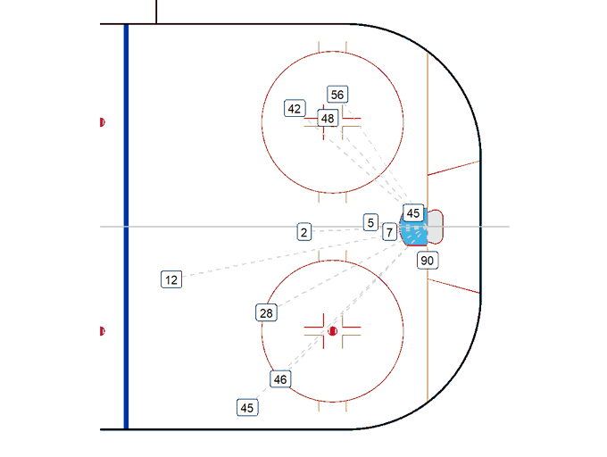

class: title-slide   
  
# Can ML Predict Goals Based on Shots Play by Play Data?
## ECON 5252 Final Project
### Davis Dunkleberger 

---
# Introduction to Hockey Analytics
1. Hockey analytics is player evaluation driven
2. Scoring goals leads to more wins
3. Find new ways to advance

---
# Machine Learning
1. Possible application in sports
2. Is it predictive enough for hockey?

---

# Data
1. hockeyR package scrapes play by play data
2. Create factors for SH, PP, and goal
3. Remove 100+ unnecessary columns for training process
4. Use Goal, Shot Distance, Shot Angle, Period, Period Seconds Remaining, Short Handed, and Power Play Variables
5. Shot distance from the center of the net

---

# Methods
Model to train with:
$$Goal=\beta_{1} SD + \beta_{2} SA + \beta_{3} P + \beta_{4} PSR + \beta_{5} SH + \beta_{6} PP + \varepsilon$$
- Training and testing ML models to see which is most accurate classifying goals
  - Logit, Tree Model, Neural Net, and KNN
- SVM excluded due to computer limitations
- Goal is a binary value

---
# Findings

| Algorithm | Accuracy | Penalty | Other Parameters |
|----------|----------|----------| ----------|
| Logit | 0.93 | 0.00 | NA |
| Tree Model | 0.93 | NA | Cost Complexity, 0; Tree Depth, 10; Min_N, 10 |
| Neural Net | 0.93 | 0.00 | Hidden Units, 7 |
| KNN | 0.93 | NA | Neighbors 29.00 |

---
# Concluding Remarks
1. Insights from the ML results
 - Machines can be very accurate
 - Could be used to evaluate goal scoring for certain players
2. Limitations
 - Limited variables used
 - Skaters and Goalies not accounted for
 
 